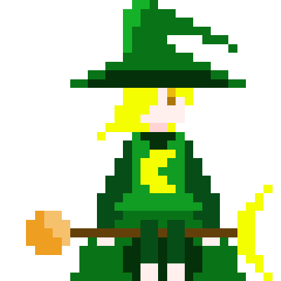

<!-- 要件定義書、絶対に今週中に完成させます。 -->

# ゲーム概要 

## 説明

* QRコードを利用して魔法に変え、戦うターン性ゲーム

## 基本情報

* プレイ時間 : 約1～3分

* 人数 : 1人or2人

* 操作方法 : QRコードリーダー、マウス

* 出店目標 : 2019年津田沼祭

# キャラクター

## 概要

* このゲームでプレイヤーまたはCPUによって操作されるオブジェクト

## 基本情報

* HP  
    キャラクタ―はそれぞれ固定の整数HPを持つ。  
    魔法による攻撃よってのみ減少し、それ以外の方法で変動することはない。

* 名前  
    固定で与えられる他キャラクターと被らない文字列  
    ゲームプレイヤーは主に名前からそれぞれのキャラクターを識別する。

* 攻撃   
    自機ではQRコードを用いて、敵は乱数から文字列を取得。
    それを魔法に変換して使用し、相手のHPを減らす動作。

# 自機  

## 概要  
* プレイヤーが操作するキャラクター  
一人目が操作するキャラクターはPlayer1、二人目はPlayer2が固定で選ばれる。

## 自機一覧   
| 名前 | イラスト | HP |
|:---:|--------:|:---:|
|Player1|  | 18004 |
|Player2|  | 18004 |

# 敵

## 概要  
* 一人プレイの時、対戦相手としてコンピュータが操作するキャラクター  
難易度に応じて以下のように登場する敵を変更する。  
(ただし、HPはゲーム性を考慮して変更する可能性あり。) 

## 敵一覧
| 名前 | イラスト | HP | 登場難易度 |
|:---:|--------:|:---:|:---------:|
|コープスソウル　　 |  | 2147483647 | 上級 |
|パンプキントーテム |  | 65535      | 中級 |
|ほうきおばけ |  | 32767      | 初級 |

# 魔法

## 概要  
* 与えられた文字列からハッシュ値を取得して以下の要素を保持する。  
ただし、QRコードから得られる結果は、実行環境に関わらず同じになる必要がある。

## 基本情報
* 攻撃力  
キャラクターが攻撃する際、相手のHPを減らす分の整数値を表す。

* タイプ(実装は未定)  
    火とか水とか木とか。詳細も未定。

* 属性(自機限定)  
QRコードによって読み取られた文字列が、TwitterやLINEのアカウントURLだった場合に起きる、特殊な要素。  
属性を持つ場合、通常と比べて攻撃力が上昇する。
