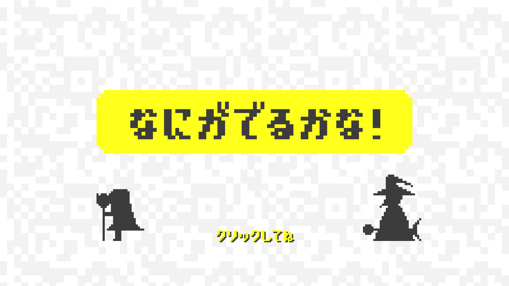

 

# ソフトメディア研究会　企画「なにがでるかな！」

## 概要
- 1～2人のターン制対戦ゲームです
- QRコードを使って魔法やキャラクターの強さが決まります
- [おおまかな仕様はこちら](DEF.md)

## ここがすごい！
- QRコードを読ませるまではどれが強いのかさっぱり分かりません
- 何度使っても同じ強さなので最強のコードを集めていくことが出来ます(ただし実行環境次第で強さが変わる可能性あり)

## 動作環境
- Windows10+QRコードリーダー

## 使用技術
### 開発環境
- Unity
- C#
### ライブラリ
- SQLite (NewTowel)
- UniRx
- DOTween

## 関連リンク
### 2019津田沼祭
- 企画発表 https://drive.google.com/open?id=1tDCpn9-K47NbV34PWBr2oOpuBRV76zc3
- 第一回進捗発表 https://drive.google.com/open?id=1-6gKmWsYeLCKtmvMd-gVMbAa3KzdFh_z
- 第二回進捗発表 https://drive.google.com/open?id=1C7tu0Scyq1q-7kjHxWWUEbW2L9yr9pDD
- 成果物発表 https://drive.google.com/open?id=15pbt147DLWc5oNLQHOLm6nSXf09-Du4f
### 2020文化の祭典
- 第二回進捗発表 https://drive.google.com/open?id=1b6g5igvxrxNCyWsFpk7mITHaXv2u0DBQ
